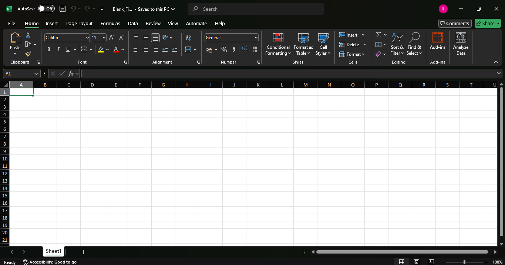
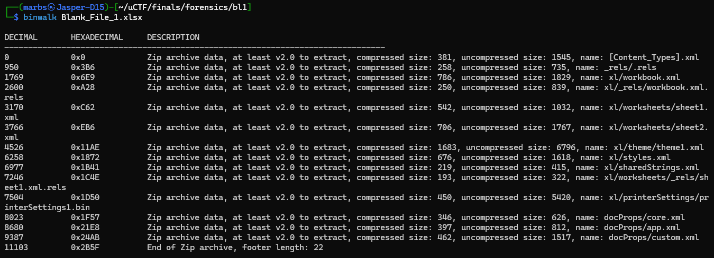
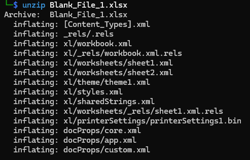
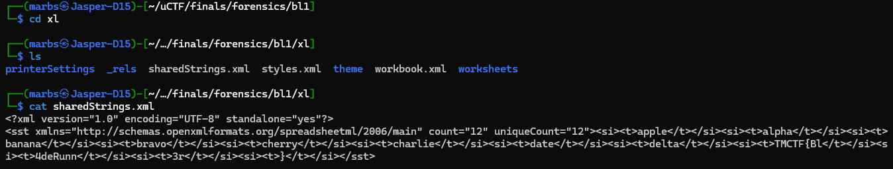

# DESCRIPTION

We were given a `.zip` file wherein inside of it is an excel file. We are tasked to find the flag within the excel file. *(If I remembered correctly)*

## MY PROCESS

When opening the excel file *(renamed the file with the .xlsx extension)*, the output is a literally blank file:

Since the file itself has no contents, I checked if there are hidden stuffs inside of the excel file by doing this:

- `binwalk <file>`

There is a zip file inside of the excel file. After that I just unzipped the excel file to get the files inside of it.

Now this is where I just trial and error stuffs. I went through every directory and read the `.xml` files to find the flag.

I stumbled on the `/xl` directory and read the `sharedStrings.xml` file, and this was the result:

I noticed that the flag is actually there, but it was being broken into chunks. I just formatted it correctly on my notepad and I got the flag.

Flag: `TMCTF{Bl4deRunn3r}`